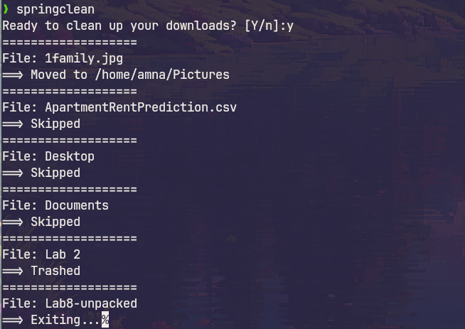

# Scripts

A collection of bash scripts with varying degrees of usefulness.

- [**springclean**](#springclean) - Downloads organizing utility
- [**unpack**](#unpack) - Universal file and archive extractor
- [**archer**](#archer) - Arch Linux news feed
- [**clicast**](#clicast) - Weather forecast

## springclean

A tool that makes organizing your downloads folder a little less terrifying.

It goes through on the contents of your downloads folder, and for each item prompts you to either move it to a folder (based on its extension), send it to trash it or skip it.

## unpack

Universal file and archive extractor.
Supports the following formats:

- zip
- gzip
- bzip
- bzip2
- rar
- tar
- 7zip

## archer

Arch Linux news feed, right in your terminal.

## clicast

CLI weather forecast utility.

